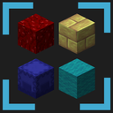

# Item Organizer

  

  <strong>A visual inventory and palette manager for Minecraft Fabric.</strong> 
  Sort blocks and items by chromatic color gradient, manage hotbar palettes, and customize your creative workflow.

  
  
  
  

---

## ✨ What Does Item Organizer Do?

**Item Organizer** is a client-side visual inventory management mod for Minecraft that revolutionizes how you organize, discover, and build with blocks:

- **Chromatic Color Gradient Sorting**: Dynamically samples and analyzes the textures of blocks and items (including modded items) to arrange them in a smooth, perceptually accurate chromatic color gradient.
- **Smart Texture & Model Inspection**: Automatically recognizes non-cube items, glass panes, iron bars, pottery sherds, mob heads, slabs, and stairs, ensuring clean visual grouping without hardcoded lists.
- **Hotbar Palette Manager**:
  - Create, save, rename, and duplicate custom building palettes.
  - Search filter to instantly find the palette you need.
  - One-click load directly into your active player hotbar.
- **Multi-Profile System**: Save different profiles for building gradients, redstone work, survival resources, or aesthetic projects, with your preferences and locked items preserved.
- **Item Blocker (Item Locking)**: Double right-click any item to hide/lock it from your organized view, keeping unwanted blocks from cluttering your space.
- **Visual Customization**: Real-time adjustable sliders for background blur intensity (from clean glassmorphism to deep blur), grid zoom, item scale, palette scale, and text scale.

---

## 💡 Why Should You Download It?

- **Master Gradients & Color Transitions**: Stop guessing which block blends best into another. See every block laid out in an intuitive color spectrum so you can pick gradient transitions in seconds.
- **Supercharge Your Building Speed**: No more spending minutes clicking through endless creative tabs or digging through storage chests to find a block. Store your favorite block combinations in custom palettes and load them into your hotbar with one click.
- **100% Modded Support**: Because color analysis is computed dynamically from item textures and models, Item Organizer works out-of-the-box with any modded blocks you have installed.
- **Modern, Clean Aesthetic**: Designed with an elegant, responsive glassmorphic interface that looks and feels like a modern creative tool rather than a cluttered legacy menu.

---

## ⚠️ Critical Information Before Downloading

Please review the following requirements before installing:

- **100% Client-Side Only**: Item Organizer runs entirely on your client. It does **not** need to be installed on servers and will cause no issues when joining vanilla, Fabric, Paper, Purpur, or Spigot multiplayer servers.
- **Requires Fabric Loader & Fabric API**: Make sure you have both [Fabric Loader](https://fabricmc.net/) and [Fabric API](https://modrinth.com/mod/fabric-api) installed for your corresponding Minecraft version (1.21.10 or 1.21.11).
- **Default Keybind**: Press **`O`** in-game to open the organizer screen. You can rebind this key at any time in the in-game **Config** tab or in the standard Minecraft Controls menu (`Esc > Options > Controls > Key Binds`).

---

## 🎮 Controls & Keybindings

| Action / Key | Function |
| :--- | :--- |
| **`O`** *(default)* | Open / close the Item Organizer interface |
| **`Left Click`** | Select or drag an item, activate buttons |
| **`Double Right Click`** | Lock / unlock an item (add to Blocker list) |
| **`Escape`** | Close the screen |

*All keybindings and UI scales can be adjusted directly from the in-game **Config** tab.*

---

## 📦 Installation Guide

1. Download and install [Fabric Loader](https://fabricmc.net/use/installer/) (for Minecraft 1.21.10 or 1.21.11).
2. Download the matching version of [Fabric API](https://modrinth.com/mod/fabric-api).
3. Download **Item Organizer** from [Modrinth](https://modrinth.com/mod/item-organizer) or [CurseForge](https://curseforge.com/).
4. Drop both `.jar` files into your `.minecraft/mods` folder.
5. Launch Minecraft, enter any world or server, and press **`O`**!

---

## 📄 License

This project is licensed under the [MIT License](LICENSE).
